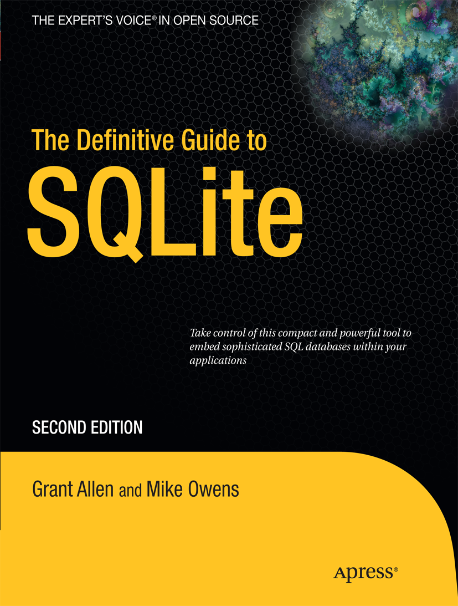

# The Definitive Guide to SQLite
  
 
## info
* [publisher](http://link.springer.com/book/10.1007/978-1-4302-3226-1)  
* [companion](http://www.apress.com/gp/book/9781430232254?wt_mc=ThirdParty.SpringerLink.3.EPR653.About_eBook)  

## toc
* Chapter 1 Introducing SQLite  
* Chapter 2 Getting Started  
* Chapter 3 SQL for SQLite  
* Chapter 4 Advanced SQL for SQLite  
* Chapter 5 SQLite Design and Concepts  
* Chapter 6 The Core C API  
* Chapter 7 The Extension C API  
* Chapter 8 Language Extensions   
* Chapter 9 iOS Development with SQLite  
* Chapter 10 Android Development with SQLite  
* Chapter 11 SQLite Internals and New Features  